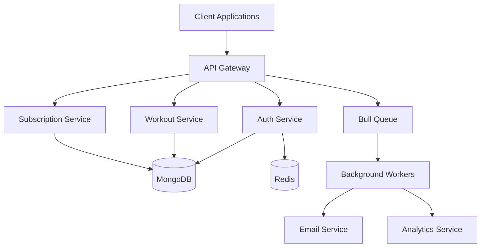

## 🏋️‍♂️ Fitness App - Enterprise Backend

A scalable, secure, and feature-rich fitness application backend built with Node.js and Express.

### 🏗 Architecture



### 💾 Database Schema

#### User Collection
```javascript
{
  username: String,
  email: String,
  password: String (hashed),
  role: Enum['user', 'trainer', 'admin'],
  subscription: {
    plan: Enum['free', 'basic', 'premium'],
    validUntil: Date,
    stripeCustomerId: String
  },
  twoFactorSecret: String,
  twoFactorEnabled: Boolean,
  profileImage: String,
  googleId: String,
  createdAt: Date
}
```

#### Workout Collection
```javascript
{
  user: ObjectId,
  title: String,
  description: String,
  type: Enum['strength', 'cardio', 'flexibility', 'hiit'],
  exercises: [{
    name: String,
    sets: Number,
    reps: Number,
    weight: Number,
    duration: Number,
    notes: String
  }],
  duration: Number,
  difficulty: Enum['beginner', 'intermediate', 'advanced'],
  scheduledFor: Date,
  completed: Boolean,
  createdAt: Date
}
```

### 🔐 Authentication Endpoints

#### POST /api/auth/register
Register a new user
```javascript
{
  "email": "user@example.com",
  "password": "SecurePass123!",
  "username": "fitnessuser"
}
```

#### POST /api/auth/login
Login with credentials
```javascript
{
  "email": "user@example.com",
  "password": "SecurePass123!"
}
```

#### POST /api/auth/2fa/setup
Enable 2FA (requires authentication)
```javascript
// Response includes QR code URL
```

### 💰 Subscription Endpoints

#### GET /api/subscription/plans
Get available subscription plans
```javascript
// Returns list of plans with pricing
```

#### POST /api/subscription/subscribe
Subscribe to a plan (requires authentication)
```javascript
{
  "planId": "price_premium"
}
```

### 🏋️‍♀️ Workout Endpoints

#### POST /api/workouts
Create a new workout (requires authentication)
```javascript
{
  "title": "Morning Routine",
  "type": "strength",
  "exercises": [
    {
      "name": "Push-ups",
      "sets": 3,
      "reps": 12
    }
  ]
}
```

### 🔒 Security Features

- JWT-based authentication
- Role-based access control
- Rate limiting
- Request validation
- XSS protection
- CSRF protection
- Input sanitization
- 2FA support

### 📊 Performance Features

- Redis caching
- Bull queue for background jobs
- Elastic APM monitoring
- Winston logging
- Response compression
- Database indexing

### 🔄 Error Handling

Standardized error responses:
```javascript
{
  "status": "error",
  "error": {
    "code": "ERROR_CODE",
    "message": "Error description",
    "details": {} // Optional details
  }
}
